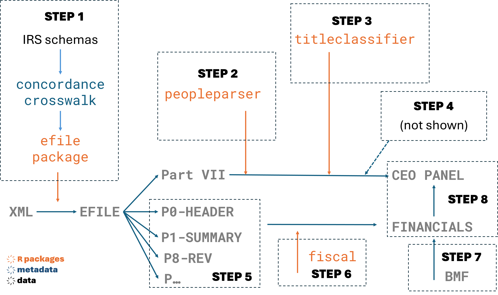
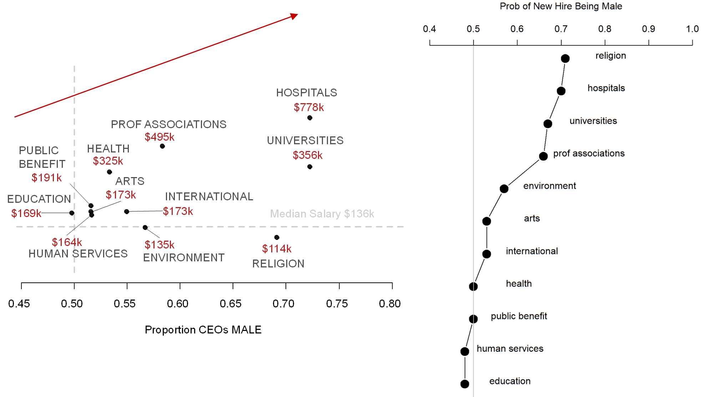

```{r setup, include=FALSE}
knitr::opts_chunk$set(echo = TRUE, message=F, warning=F, fig.width = 10, fig.pos = 'H')
```


## A Workflow Demonstration 

This script will present several new components of the Nonprofit Open Data Collective data environment using an example motivated by the "Glass Cliff", or the idea the women are more likely to be appointed to precarious positions of power relative to their male counterparts. 

We specifically want to highlight the value of an integrated data environment developed around the EFILE Database, one of the emerging research centerpieces in nonprofit scholarship. This tutorial demonstrates a reproducible data engineering workflow that follows [FAIR Data Guidelines](https://www.nature.com/articles/sdata201618). We will answer the research question using a dataset created through the following 8 Steps: 




1. Build tables using the **irs990efile** package. 
2. Standardize names of the leadership team present in Part VII (the compensation tables) using the **peopleparser** package. 
3. Standardize titles in Part VII using the **titleclassifier** package. 
4. Identify CEO transition years within the data. 
5. Build a financial dataset by combining the following 990 Parts: revenues, expenses, and assets. 
6. Generate common financial operating ratios using the **fiscal** package. 
7. Add NTEE codes and standardized address fields from the Unified BMF. 
8. Merge financial tables and compensation tables into a single table for the analysis. 


We are using the term "integrated data environment" here to mean: 

- consistent variable names 
- consistent record IDs 
- consistent metadata 
- consistent definitions of "year" (tax year, not fiscal year or filing year)

These things allow us to create more expressive and intuitive data steps that anyone can replicate. It also allows researchers to create custom tools for refining or analyzing data, as demonstrated by the packages used in this workflow.  


## Glass Cliff Research 

> The glass cliff is a hypothesized phenomenon in which women are more likely to break the "glass ceiling" (i.e. achieve leadership roles in business and government) during periods of crisis or downturn when the risk of failure is highest.

We know from previous studies that male CEOs are put in charge of large, thriving nonprofits while women are more likely to be hired to lead smaller social services organizations. 

Here we explore the question of whether female CEOs are more likely to be hired when the current leader is struggling.   


 
*Grasse, N. J., Heidbreder, B., Kukla-Acevedo, S. A., & Lecy, J. D. (2024). Some Good News, More Bad News: Two Decades of the Gender Pay Gap for Nonprofit Directors and Chief Financial Officers. Review of Public Personnel Administration, [0734371X241248854](https://journals.sagepub.com/doi/full/10.1177/0734371X241248854).*

## Data and Software

### Efile Data

Processed IRS 990 Efile data are housed in the [NCCS Data Catalog](https://nccs.urban.org/nccs/catalogs). You can find further information about sources, processing, and variable descriptions here: 

- [Efile Data Catalog](https://nccs.urban.org/nccs/catalogs/catalog-efile.html)
- [Efile Data Dictionary](https://nonprofit-open-data-collective.github.io/irs990efile/data-dictionary/data-dictionary.html)


### R Packages

There is a growing library of nonprofit tools: 

- [Open Data Collective Landing Page](https://nonprofit-open-data-collective.github.io/tools/)


We will be using the following packages for the demo: 

```{r, eval=F}
devtools::install_github( 'Nonprofit-Open-Data-Collective/peopleparser' )
devtools::install_github( 'nonprofit-open-data-collective/titleclassifier' )
devtools::install_github( 'nonprofit-open-data-collective/fiscal')
devtools::install_github( 'nonprofit-open-data-collective/irs990efile')
```


```{r packages}
library( tidyverse )
library( pander )
library( data.table )
library( RecordLinkage )
library( reshape2 )
library( ggrepel )
library( utils )

# nonprofit data packages 
library( peopleparser )
library( titleclassifier )
library( fiscal )

# helper functions for the demo: 
nodc <- "https://raw.githubusercontent.com/Nonprofit-Open-Data-Collective/"
repo <- "arnova-2024/refs/heads/main/"
file <- "functions.R"
source( paste0( nodc, repo, file ) )
```


## STEP 1: Building Efile Tables from Scratch


This step builds Efile tables by loading raw XML efile returns from the Data Commons and using the **irs990efile** package to parse XML files into rectangular CSV tables. 

This code creates data for a sample of 100 nonprofits from 2018:

```{r, eval=F}
library( irs990efile )

index <- build_index( tax.years=2018 )

index100 <-
  index %>% 
  filter( FormType %in% c("990","990EZ") ) %>%
  sample_n( 100 )

TABLES <- c( "F9-P00-T00-HEADER",
             "F9-P01-T00-SUMMARY",
             "F9-P08-T00-REVENUE",
             "F9-P09-T00-EXPENSES",
             "F9-P11-T00-ASSETS" )

URLS <- index100$URL

build_tables( urls=URLS, year=2018, table.names=TABLES  )
```

Typically you would not need to replicate this step since it is a computationally-intensive process. It can take a couple of days to build the full efile database. It is much easier to pull existing CSV files from NCCS: 

[**EFILE DATA CATALOG**](https://nccs.urban.org/nccs/catalogs/catalog-efile.html).


There are two main ways to access the pre-built tables of the data. You can download the data locally to your computer from the data catalog and read it into your R environment or you can use some helper functions to read it directly in R. We present examples of both below. 
\

```{r, eval=F}
# LOCAL DATA

df2010 <- read.csv( "Coding/Data/PartVII/PartVII-2010.csv" )
df2011 <- read.csv( "Coding/Data/PartVII/PartVII-2011.csv" )
```


```{r, eval=F}
# HELPER FUNCTIONS:
# nodc <- "https://raw.githubusercontent.com/Nonprofit-Open-Data-Collective/"
# repo <- "arnova-2024/refs/heads/main/"
# file <- "functions.R"
# source( paste0( nodc, repo, file ) )

df2010.fun <- get_partvii(2010)
df2011.fun <- get_partvii(2011)
```

```r
get_partvii <- function( year ){
  root <- "https://nccs-efile.s3.us-east-1.amazonaws.com/parsed/partvii/PARTVII-"
  url  <- paste0( root, year, ".csv" )
  df   <- data.table::fread( url, colClasses=c( "ObjectId"="character" )  )
  df$EIN2 <- format_ein( df$ORG_EIN )
  return( df )
}
```


## STEP 2: Parse DTK Names 

The main variables of interest in these data are the board member names and their titles. We will utilize pre-built packages from the [Nonprofit Open Data Repositories](https://github.com/orgs/Nonprofit-Open-Data-Collective/repositories) to clean these variables further (the packages are `peopleparser` and `titleclassifier`).


```{r, message = F}
root    <- paste0( nodc, repo )
fn      <- "data/PART-VII-SAMPLE-10.CSV"
url     <- paste0( root, fn )
partvii <- read.csv( url )
```


```{r, echo=F}
keep <-
  c("NAME", "TAXYR", "FORMTYPE", 
    "F9_07_COMP_DTK_NAME_PERS", "F9_07_COMP_DTK_TITLE", 
    "F9_07_COMP_DTK_AVE_HOUR_WEEK", "F9_07_COMP_DTK_COMP_ORG")
partvii[keep] |> head() |> pander::pander()
```


Now let's use peopleparser to clean the names. Names do not arrive standardized in any specific format:  

```{r, echo=F}
# names are not standardized in the raw data 
partvii$F9_07_COMP_DTK_NAME_PERS %>% 
  sample( 3 ) %>% 
  paste0( collapse="  ;;  " ) %>%
  cat( sep="\n")

partvii$F9_07_COMP_DTK_NAME_PERS %>% 
  sample( 3 ) %>% 
  paste0( collapse="  ;;  " ) %>%
  cat( sep="\n" )

partvii$F9_07_COMP_DTK_NAME_PERS %>% 
  sample( 3 ) %>% 
  paste0( collapse="  ;;  " ) %>%
  cat( sep="\n" )

partvii$F9_07_COMP_DTK_NAME_PERS %>% 
  sample( 3 ) %>% 
  paste0( collapse="  ;;  " ) %>%
  cat( sep="\n" )

partvii$F9_07_COMP_DTK_NAME_PERS %>% 
  sample( 3 ) %>% 
  paste0( collapse="  ;;  " ) %>%
  cat( sep="\n" )
```


The **peopleparser** package will remove nuisance text and split the name string into 5 parts: 

- prefix (titles)
- first name 
- middle name 
- last name 
- suffix (jr, sr, i, ii, etc.)

And add a predicted gender label (M/F/U) plus confidence level once it is able to identify the individual's first name: 

```{r}
peopleparser::parse.name( "(1) Rev Kendrick R Wilson III" )
```
```{r}
peopleparser::parse.name( "Doctor Wilson III, Kendrick R" )
```
```{r}
# gender prediction is based on first names
peopleparser::parse.name( "Wilson, K R Until June 2008" )
```


```{r}
nm <- partvii[[ "F9_07_COMP_DTK_NAME_PERS" ]] %>% unique()
nm.parsed <- peopleparser::parse.names( nm )
```


```{r, echo=F}
nm.parsed %>% head() %>% pander::pander()
```


Join parsed names back to the original data frame. 

```{r}
# CORE R VERSION OF A TABLE JOIN 
partvii <- 
  partvii %>% 
  merge( nm.parsed, 
         by.x="F9_07_COMP_DTK_NAME_PERS", by.y="name", 
         all.x=T )
```

```{r, eval=F}
# TIDYVERSE VERSION OF A TABLE JOIN
partvii <- 
  partvii %>% 
  left_join( nm.parsed, 
             by=c( "F9_07_COMP_DTK_NAME_PERS" = "name" ) )
```

```{r, eval=F}
write.csv( partvii, "data/PART-VII-SAMPLE-10-PARSED-NAMES.CSV", row.names=F )
```


## STEP 3: Standardize Titles 


```{r, eval=F}
root    <- paste0( nodc, repo )
fn      <- "data/PART-VII-SAMPLE-10-PARSED-NAMES.CSV"
url     <- paste0( root, fn )
partvii <- read.csv( url )
```


```{r, message = F}
# steps from titleclassifier package 

titles <-  
  partvii %>% 
  standardize_df() %>% 
  remove_dates() %>% 
  standardize_conj() %>% 
  split_titles() %>% 
  standardize_spelling() %>% 
  gen_status_codes() %>% 
  standardize_titles() %>%
  categorize_titles()
```

```{r, echo=F}
titles <- dplyr::arrange( titles, desc(ein), desc(taxyr), desc(tot.comp.incl.rltd) )

keep1 <- 
c( "dtk.name", "title.raw",
   "title.mult.x", "title.order")

titles[keep1] %>% head(10) %>% pander::pander()
```

Title processing steps from the package: 

```{r, echo=F}
keep2 <- 
c( "title.raw","title.v4","title.v7", "title.standard" ) 

titles[ 150:165, keep2 ] %>% pander::pander()
```

Pay and hours tabulated relative to other employees in the same org: 

```{r, echo=F}
keep3 <- 
c( "dtk.name", "title.standard",
   "tot.hours", "hours.rank", 
   "tot.comp", "pay.max", "pay.rank" ) 

these <- titles$taxyr == 2019 & titles$ein == "60840436"
# titles[ these, keep3 ]  %>% pander::pander()

these <- titles$taxyr == 2018 & titles$ein == "60840436"
# titles[ these, keep3 ]  %>% pander::pander()

these <- titles$taxyr == 2017 & titles$ein == "60840436"
titles[ these, keep3 ]  %>% pander::pander()
```


```{r}
partvii <- 
  merge( partvii, titles, 
         by.x=c("EIN","TAXYR"), by.y=c("ein","taxyr"),
         all.x=TRUE )
```


```{r}
fn <- "data/PART-VII-SAMPLE-10-PARSED-NAMES-TITLES.CSV"
write.csv( partvii, fn, row.names=F )
```


## STEP 4: Identify CEO Transitions

There are several data cleaning and preparation steps that need to be performed on the base data before our analysis. We are omitting this step because it is outside the scope of the workflow. All that you need to know is leadership transitions are identified by isolating CEOs and finding periods where the individuals change. Transitions are labeled as:

- MM: outgoing male ceo, incoming male ceo
- MF: outgoing male ceo, incoming female ceo
- FM: outgoing female ceo, incoming male ceo
- FF: outgoing female ceo, incoming female ceo 


We provide a cleaned subset of the data. We provide two dataframes of 1000 and 10 unique nonprofits that experienced at least one CEO transition between 2009 and 2019. It should be noted that it is possible for these organizations to experience more than one transition during this time frame. As such, we have a total of 1067 transitions. We can analyze various facets of these transitions. 
\

```{r, echo=F}
#changed from _fncl to base data

root    <- paste0( nodc, repo )
fn      <- "data/toy_CEO_trans_1000EIN_fncl.csv"
url     <- paste0( root, fn )
ceo_trans_1000     <- read.csv( url )

#A more basic function for local data
# ceo_trans_1000 <- read.csv("toy_CEO_trans_1000EIN.csv")

```


## STEP 5: Compile Financials


We will first build a financials table by selecting the relevant 990 parts, then combining them: 

```{r}
##   JOINING ONE TO ONE TABLES

root <- paste0( nodc, repo )

fn1  <- "data/F9-P00-T00-HEADER-SAMPLE-10.CSV"
fn2  <- "data/F9-P01-T00-SUMMARY-SAMPLE-10.CSV"
fn3  <- "data/F9-P08-T00-REVENUE-SAMPLE-10.CSV"
fn4  <- "data/F9-P09-T00-EXPENSES-SAMPLE-10.CSV"
fn5  <- "data/F9-P10-T00-BALANCE-SHEET-SAMPLE-10.CSV"

d1 <- read.csv( paste0( root, fn1 )  )
d2 <- read.csv( paste0( root, fn2 )  )
d3 <- read.csv( paste0( root, fn3 )  )
d4 <- read.csv( paste0( root, fn4 )  )
d5 <- read.csv( paste0( root, fn5 )  )
```

The efile one-to-one tables all share the same IDs:

```{r}
intersect( names(d1), names(d2) )
```

Which makes merging files easy: 

```{r}
df <- merge( d1, d2 )
df <- merge( df, d3 )
df <- merge( df, d4 )
df <- merge( df, d5 )
```


```{r}
write.csv( df, "data/FINANCIALS.CSV" )
```


Note that dataset dimensions should not change for one-to-one merges: 

```{r}
dim(d1)
dim(d2)
dim(df)
```


See the appendix for the code used to compile the five tables above for the sample. 
\
\
We can also follow similar steps for the 1000 EIN observations. We don't show the steps here due to their run time but instead provide the compiled df and some further steps to prepare it for analysis and understand the data. 
\
```{r, echo=F}
#changed from _fncl to base data

root    <- paste0( nodc, repo )
fn      <- "data/toy_CEO_trans_1000EIN_fncl.csv"
url     <- paste0( root, fn )
ceo_trans_1000_fncl     <- read.csv( url )

#This df 
# ceo_trans_1000_fncl<- read.csv("toy_CEO_trans_1000EIN_fncl.csv")

#First need to denote transitions 
ceo_trans_1000_fncl<- ceo_trans_1000_fncl%>%
  arrange(EIN, transition_no, TAXYR)%>% #for each org, transition, and year, 
  group_by(EIN, transition_no) %>%       
  mutate(period = row_number())%>%       #let's denote which period the row is relative to (i.e., how many years before /after a transition)
  ungroup()

#Let's make this variable a bit more readable
ceo_trans_1000_fncl$period <- paste0("T", ceo_trans_1000_fncl$period-3)
ceo_trans_1000_fncl$period <- factor(ceo_trans_1000_fncl$period, levels = c("T-2", "T-1", "T0" , "T1", "T2"))


# Need to get transition type too:
# We want to know if the transition 
#  is M>M, M>F, F>M, or F>M
# We will first create a string of the CEO 
#  gender throughout the 5 year period
# The we will create a column that keeps 
# the first and last gender (this is the gender transition)

ceo_trans_1000_fncl_wT <- 
  ceo_trans_1000_fncl %>%
  group_by(EIN, transition_no) %>%
  mutate( trans_tot = str_c( unlist( 
    strsplit( paste( gender, collapse = ""), "") ), collapse = "") ) %>%
  mutate(
    trans_type = str_sub(trans_tot, 1, 1) %>%
      str_c(str_sub(trans_tot, nchar(trans_tot), 
                    nchar(trans_tot)))  # Combine 1st and last letter
    
  )

#We want this variable to be a factor
ceo_trans_1000_fncl_wT$trans_type <- 
  as.factor(ceo_trans_1000_fncl_wT$trans_type)

write.csv( ceo_trans_1000_fncl_wT, "toy_ceo_trans_1000EIN_fncl_wT.csv" )
```


```{r}
peek <- 
  c( "EIN","TAXYR",
     "period", "CEO1", 
     "CEO2",  "trans_type" )

ceo_trans_1000_fncl_wT[ 1:40, peek ] %>% pander::pander()
```


```{r,  echo=F}
# We're going to get firm attributes by transition type
# Let's consider the attributes at t-1
# We'll consider basic variables like number of employees, total assets, etc.

# Note that further data cleaning is necessary 
# for final presentation due to NA values input 
# into some of these columns. For now, we will 
# just remove the nas and continue with our analysis

temp <- ceo_trans_1000_fncl_wT %>% group_by(trans_type)%>%
  filter(period == "T-1") %>%
  summarize(count = n(),
    num_emp_av =mean(F9_01_ACT_GVRN_EMPL_TOT, na.rm = T),
            num_emp_sd = sd(F9_01_ACT_GVRN_EMPL_TOT, na.rm = T),
            num_vol_av = mean(F9_01_ACT_GVRN_VOL_TOT, na.rm = T),
            num_vol_sd = sd(F9_01_ACT_GVRN_VOL_TOT, na.rm = T),
            total_exp_av = mean(F9_01_EXP_TOT_PY, na.rm = T),
            total_exp_sd = sd(F9_01_EXP_TOT_PY, na.rm = T),
            total_assets_av = mean(F9_01_NAFB_ASSET_TOT_BOY, na.rm = T),
            total_assets_sd = sd(F9_01_NAFB_ASSET_TOT_BOY, na.rm = T))

temp
```


There are 349 transitions from male to male (MM) transitions, 253 male to female transitions (MF), 160 female to male transitions (FM), and 305 female to female transitions (FF) in our dataset. FF orgs have the smallest number of employees, on average while MF have the highest. It should be noted that the standard deviation for number of employees is pretty high, suggesting a wide range of nonprofits. MM nonprofits have the highest total expeness on average and the highest total assets. Again, the SDs are wide, suggesting large variation across observations.


## STEP 6: Add Financial Operating Ratios 


```{r, eval=F}
root <- paste0( nodc, repo )
fn   <- "data/FINANCIALS.CSV"
df   <- read.csv( paste0( root, fn )  )
```

```{r, echo=F}
df[ 1:5, 88:90 ] %>% knitr::kable()
```

The **fiscal** package contains the following financial ratios: 

```{r, eval=F}
df <- get_aer( df )     #	Assets to Revenues Ratio
df <- get_arr( df )     #	Assets to Revenues Ratio
df <- get_cr( df )      #	Current Ratio
df <- get_dar( df )     #	Debt to Asset Ratio
df <- get_der( df )     #	Debt to Equity Ratio
df <- get_dgdr( df )    #	Donation/Grant Dependence Ratio
df <- get_dmr( df )     #	Debt Management Ratio
df <- get_doch( df )    #	Days of Operating Cash on Hand
df <- get_doci( df )    #	Days of Operating Cash and Investments
df <- get_eidr( df )    #	Earned Income Dependence Ratio
df <- get_er( df )      #	Equity Ratio
df <- get_ggr( df )     #	Government Grants Ratio
df <- get_iidr( df )    #	Investment Income Dependence Ratio
df <- get_lar( df )     #	Lands to Assets Ratio
df <- get_moch( df )    #	Months of Operating Cash on Hand
df <- get_or( df )      #	Operating Margin
df <- get_per( df )     #	Program Efficiency Ratio
df <- get_podpm( df )   #	Post-Depreciation Profitability Margin
df <- get_predpm( df )  #	Pre-Depreciation Profitability Margin
df <- get_qr( df )      #	Quick Ratio
df <- get_ssr( df )     #	Self Sufficiency Ratio
df <- get_stdr( df )    #	Short Term Debt Ratio
```

We will add the post-depreciation profitability margin and the quick ratio to the data: 

```{r}
df <- get_podpm( df ) 
df <- get_dgdr( df )
```

For details on the definitions and calculation of the ratios try: 

```{r, eval=F}
help( get_dgdr )
```

```{r}
write.csv( df, "data/FINANCIALS-W-RATIOS.CSV", row.names=F )
```


## STEP 7: Add BMF Fields 


The Business Master File contains important information not available on 990 forms such as organizational NTEE codes. In addition, the NCCS BMF files contain standardized geographies and other useful information. 

The BMF rows for our sample have been precompiled: 

```{r}
root <- paste0( nodc, repo )
fn   <- "data/bmf_unified_10.csv"
bmf  <- read.csv( paste0( root, fn ) )
```

```{r, eval=F}
root <- paste0( nodc, repo )
fn   <- "data/FINANCIALS-W-RATIOS.CSV"
df   <- read.csv( paste0( root, fn )  )
```

```{r}
df <- merge( df, bmf, by="EIN2" )
```

```{r}
write.csv( df, "data/FINANCIALS-W-RATIOS-PLUS-BMF.CSV", row.names=F )
```


## STEP 8: Glass Cliff Analysis

Now we're ready for some analyses! The Glass Cliff Phenomenon hypothesizes that women are chosen for positions of power when these positions are more precarious. One way to denote a precarious position is by the firm's financial performance; poor financial performance suggests more precariousness. We acknowledge that financial performance is comprised of several different dimensions and it is sometimes hard to arrive at clean conclusions about "poorly performing nonprofits." For demonstration purposes we will specifically focus on the financial performance metric of post-depreciation profitability margin (podpm). This is defined as an income measure that determines a firm's profitability after incorporating non-cash expenses. Higher values of this metric are generally desirable because the indicate that an org is not lost its revenue to expenses. We will use the package `fiscal` from the Open Data Collective to calculate our variable of interest. The default parameters of the respective functions are already built for the 990 naming conventions so usage is pretty straight forward!


```{r}

ceo_trans_1000EIN_fncl_wT <- read.csv("toy_ceo_trans_1000EIN_fncl_wT.csv")
ceo_trans_1000EIN_fncl_wT <- get_podpm(ceo_trans_1000EIN_fncl_wT)

#Let's plot these measures
plot_temp <- ceo_trans_1000EIN_fncl_wT %>%
  group_by(trans_type, period)%>%
  summarize(median_podpm =median(podpm, na.rm = T))

txt <- 
  "Median Post-Depreciation Profitability Margin by Transition Type"

ggplot( data = plot_temp, 
        aes( x = period, y = median_podpm, 
             group = trans_type, color = trans_type ) ) + 
  geom_line(linewidth = 1.5)+ 
  geom_text_repel( aes(label = round(median_podpm,3)), size = 5, 
                   nudge_x = -0.07, nudge_y = 0.001, 
                   segment.size = 0, segment.color = NA ) +
  theme_bw( ) + 
#  theme(text = element_text(size = 24))+
  scale_x_discrete(labels = c("T-2", "T-1", "Transition", "T+1", "T+2"))+
  labs(color = "Transition" ) +
  xlab( "Period" )+
  ylab( "Median Post-Depreciation Profitability Margin" ) +
  ggtitle( txt ) +
  geom_vline( xintercept = 3, linetype = "dashed" )


################################################
#Now doing density plots of these respective vars
################################################

#Let's compare the MM density to MF density in the t-1 period for the vats

ceo_trans_1000_fncl_MM <- 
  ceo_trans_1000EIN_fncl_wT %>% 
  filter(trans_type == "MM" & period == "T-1")

ceo_trans_1000_fncl_MF <- 
  ceo_trans_1000EIN_fncl_wT %>% 
  filter(trans_type == "MF"& period == "T-1")

txt <-
  "Density ofPost-Depreciation Profitability Margin by Transition at t-1"

ggplot() + 
  geom_density( data = ceo_trans_1000_fncl_MM,  
                aes(x = podpm, fill = "lightblue"), alpha = 0.5) +
  geom_density( data = ceo_trans_1000_fncl_MF,  
                aes(x = podpm, fill = "pink"), alpha = 0.5) +
  xlim(-1,1)+
  theme_bw()+

  scale_fill_manual( name = "Transition", 
                     values = c('lightblue', 'pink'), 
                     labels = c("pink" = "MF" ,  "lightblue" = "MM") ) +
  xlab( "Post-Depreciation Profitability Margin" )+
  ylab( "Density" ) +
  ggtitle( txt ) 
  

```

The glass cliff phenomenon suggest that financial precarious NPs (seen by a significant drop in their financials between T-2 and T-1) would more likely hire a female to the CEO position. We start by looking at the PODPM variable over the periods. MM organizations start with the highest median profitability margin but also experience the steepest drop between T-2 and T-1. We see a similar slope for FM organizations although the starting point is the lowest in the entire group. MF transitions do not appear to be preceded by steep changes in profitability. If the glass cliff hypothesis were true, we would expect the observed trajectory of FM but would not expect the other firms to have similar metrics around their transitions. This graph calls for further analysis on other financial measures to determine whether FM firms display a transition during significantly more precarious times than their counterparts. 

\
\
As a final understanding of the data, we look at the distribution of PODPM at T-1. We consider the two most relevant groups of MM and MF. We see that the distribution of financial variables tends to be extremely similar to both types of transitions, again failing to provide strong motivation for a glass cliff phenomenon.


-----------


#### Financial Measures by Transitions

The Glass Cliff Phenomenon hypothesizes that women are chosen for positions of power when these positions are more precarious. One way to denote a precarious position is by the firm's financial performance; poor financial performance suggests more precariousness. We acknowledge that financial performance is comprised of several different dimensions and it is sometimes hard to arrive at clean conclusions about "poorly performing nonprofits." For demonstration purposes we will specifically focus on the financial performance metric of post-depreciation profitability margin (podpm). This is defined as an income measure that determines a firm's profitability after incorporating non-cash expenses. Higher values of this metric are generally desirable because the indicate that an org is not lost its revenue to expenses. We will use the package `fiscal` from the Open Data Collective to calculate our variable of interest. The default parameters of the respective functions are already built for the 990 naming conventions so usage is pretty straight forward!
\

```{r, message = F, warning = F, eval=F}
# Make sure to run the code chunk about 
# to ensure your df_long_fncl has all 
# the necessary variables 

#site: https://github.com/Nonprofit-Open-Data-Collective/fiscal/tree/main/R
ceo_trans_1000_fncl <- get_podpm(ceo_trans_1000_fncl)


#Let's plot these measures
plot_temp <- ceo_trans_1000_fncl %>%
  group_by(trans_type, period)%>%
  summarize(median_podpm =median(podpm, na.rm = T))


ggplot( data = plot_temp, 
        aes( x = period, 
             y = median_podpm, 
             group = trans_type, 
             color = trans_type) ) + 
  geom_line(linewidth = 1.5)+ 
  geom_text_repel( aes(label = round(median_podpm,3) ), 
                   size = 5, nudge_x = -0.07, 
                   nudge_y = 0.001, segment.size = 0, 
                   segment.color = NA) +
  theme_bw( ) + 
  scale_x_discrete(labels = c("T-2", "T-1", "Transition", "T+1", "T+2"))+
  labs(color = "Transition") +
  xlab( "Period" )+
  ylab( "Median Post-Depreciation Profitability Margin" ) +
  ggtitle("Median Post-Depreciation Profitability Margin by Transition Type") +
  geom_vline(xintercept = 3, linetype = "dashed")


################################################
#Now doing density plots of these respective vars
################################################

#Let's compare the MM density to MF density in the t-1 period for the vats

ceo_trans_1000_fncl_MM <- 
  ceo_trans_1000_fncl %>% 
  filter( trans_type == "MM" & period == "T-1" )

ceo_trans_1000_fncl_MF <- 
  ceo_trans_1000_fncl %>% 
  filter( trans_type == "MF" & period == "T-1" )


txt <- 
  "Density ofPost-Depreciation Profitability Margin by Transition at t-1"

ggplot() + 
  geom_density( data = ceo_trans_1000_fncl_MM,  
                aes(x = podpm, fill = "lightblue"), 
                alpha = 0.5 ) +
  geom_density( data = ceo_trans_1000_fncl_MF,  
                aes(x = podpm, fill = "pink"),
                alpha = 0.5 ) +
  xlim(-1,1)+
  theme_bw()+
  scale_fill_manual( name = "Transition", 
                     values = c('lightblue', 'pink'), 
                     labels = c("pink" = "MF" ,  "lightblue" = "MM") ) +
  xlab("Post-Depreciation Profitability Margin")+
  ylab("Density") +
  ggtitle( txt ) 
  

```


The glass cliff phenomenon suggest that financial precarious NPs (seen by a significant drop in their financials between T-2 and T-1) would more likely hire a female to the CEO position. We start by looking at the PODPM variable over the periods. MM organizations start with the highest median profitability margin but also experience the steepest drop between T-2 and T-1. We see a similar slope for FM organizations although the starting point is the lowest in the entire group. MF transitions do not appear to be preceded by steep changes in profitability. If the glass cliff hypothesis were true, we would expect the observed trajectory of FM but would not expect the other firms to have similar metrics around their transitions. This graph calls for further analysis on other financial measures to determine whether FM firms display a transition during significantly more precarious times than their counterparts. 

As a final understanding of the data, we look at the distribution of PODPM at T-1. We consider the two most relevant groups of MM and MF. We see that the distribution of financial variables tends to be extremely similar to both types of transitions, again failing to provide strong motivation for a glass cliff phenomenon.


<br>
<br>
<br>
<hr>
<br>
<br>
<br>


## Appendix: Step 5

The demo files above (a sample of 10 nonprofits), read directly from the demo repo on GitHub, were compiled using the following code: 

```{r, eval=F}
EIN2_10 <- 
c("EIN-02-0240383", "EIN-03-0179298", 
  "EIN-04-2104310", "EIN-04-2259692", 
  "EIN-04-2592472", "EIN-04-2596491", 
  "EIN-04-3266589", "EIN-04-3543134", 
  "EIN-05-0258941", "EIN-06-0840436" )

tables <- 
c( "F9-P00-T00-HEADER",
"F9-P01-T00-SUMMARY",
"F9-P08-T00-REVENUE",
"F9-P09-T00-EXPENSES",
"F9-P10-T00-BALANCE-SHEET")

for( i in tables )
{
  for( j in 2009:2020 )
  { 
    df <- NULL
    try( df <- get_table( i, j ) )
    if( is.null(df) ){ next }
    sub <- dplyr::filter( df$EIN2 %in% EIN2_10 )
    fn <- paste0( i, "-", j, "-SAMPLE-10.CSV" )
    write.csv( sub, fn, row.names=F, na="" )
  }
}

# COMBINE ALL YEARS TO SINGLE FILE

root <- "https://raw.githubusercontent.com/Nonprofit-Open-Data-Collective/arnova-2024/refs/heads/main/data/"

for( i in tables )
{
  d.list <- list()
  for( j in 2009:2020 )
  {
    fn <- paste0( i, "-", j, "-SAMPLE-10.CSV" )
    url <- paste0( root, fn )
    df <- read.csv( url, colClasses = "character" ) 
    d.list[[ as.character(j) ]] <- df
  }
  dd <- dplyr::bind_rows( d.list )
  filename <- paste0( i, "-SAMPLE-10.CSV" )
  write.csv( dd,  filename, row.names=F, na="" )
}

# [1] "F9-P00-T00-HEADER-SAMPLE-10.CSV"       
# [2] "F9-P01-T00-SUMMARY-SAMPLE-10.CSV"      
# [3] "F9-P08-T00-REVENUE-SAMPLE-10.CSV"      
# [4] "F9-P09-T00-EXPENSES-SAMPLE-10.CSV"     
# [5] "F9-P10-T00-BALANCE-SHEET-SAMPLE-10.CSV"
```


```{css, echo=F}
body{
     font-family:system-ui,-apple-system,"Segoe UI",Roboto,Helvetica,Arial,sans-serif;
     font-size:calc(1.5em + 0.25vw);
     font-weight:300;line-height:1.65;
     -webkit-font-smoothing:antialiased;
     -moz-osx-font-smoothing:grayscale;
     margin-left:20%;
     margin-right:20%} 
     

h1 { color: #25383C; margin-top: 60px; }

h3, h4, strong { color: #6D7B8D; }

h2 { font-size: 2em;
     margin-bottom: 40px;
     color: #726e6e; 
     margin-top: 140px;}

img { margin-top: 40px;
      margin-bottom: 50px;}
      
#TOC {
   margin-top: 60px;
   font-size: 0.9em;
}

a { color:#AF7817; } 


.footer {
  background-color:#726e6e;
  height:340px;
  color:white;
  padding: 20px 3px 20px 3px;
  margin:0px;
  line-height: normal;
}


.footer a{ color:#AF7817; text-decoration:bold !important; } 
 
 
 
 table{
   border-spacing:1px;
   margin-top:80px;
   margin-bottom:100px !important;
   margin-left: auto;
   margin-right: auto;
   align:center} 


 
td{ padding: 6px 10px 6px 10px;
    font-size:calc(0.7em + 0.25vw); } 

th{ text-align: left; } 
```


